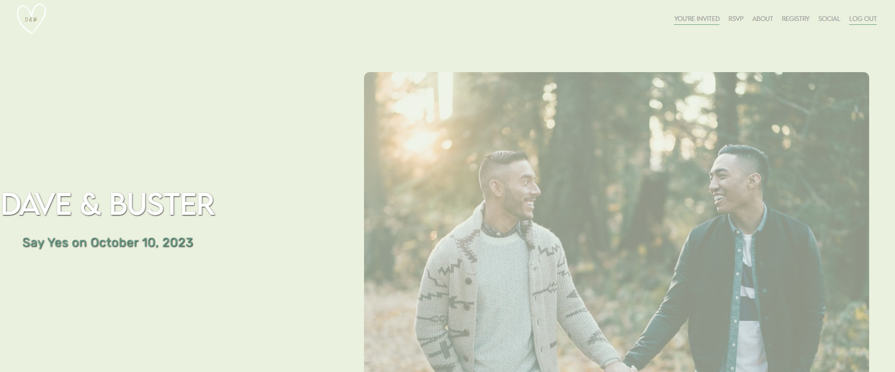

# Hitched 
Hitched is an engaged couple's personalized wedding hub. This web application acts as a concierege for their special day.

It helps engaged couples manage their wedding with features for:
Guest RSVP and add food allergies
Wedding Date Information
Social Media Page
Specialized Navigation Based on Wedding Party

## Motivation
Planning a wedding is a stressful experience for many, this web application lets the engaged couple view and organize different aspects of the planning. It allows a user to send specific information to wedding guests depending on their role in the event. 

## User story
We have different user stories based on the wedding participant:
-The engaged couple has a dashboard to view RSVPs and social pages.
-All guests can RSVP, add to Social Page, and view About and purchase items based from the Registry Page. 
-Wedding Party guests have a specific "Reception" page for the rehearsal dinner.


## Description 
Hitched is a  website hosted by the couple getting married where guests sign in using their email. 
* Once logged in guests will be taken to a landing page with a picture of the couple and the wedding date and location. 
* Users can use the navigation bar to navigate to an about me page, rsvp page, registry, and social media. 
* On the rsvp page guests will input number of guests attending and dietary preferences. 
* Guests can also pay a donation to the couples honeymoon as a wedding gift on the resistry page using stripe. 
* On the social media page guests can post images and comments aswell as comment on other users images.
* The engaged couple has a dashboard to view RSVPs and social pages.
* Wedding Party guests have a specific "Reception" page for the rehearsal dinner.


## Technology Used
* Uses the [express package](https://www.npmjs.com/package/express).
* Uses the [mongodb package](https://www.npmjs.com/package/mongodb) 
* Uses the [moongoose package](https://www.npmjs.com/package/mongoose) 
* Uses the [dotenv package](https://www.npmjs.com/package/dotenv) 
* Uses the [react package](https://www.npmjs.com/package/react)
* Uses the [bootstrap package](https://www.npmjs.com/package/bootstrap)

## Project Structure
```
├── client // contains the client-side code
│   ├── node_modules
│   ├── public
│   ├── src
│   ├── utils
│   ├── package.json
├── server // contains the server-side code
│   ├── node_modules
│   ├── config
│   ├── models // contains the MongoDB models
│   ├── schemas
│   ├── utils
│   ├── package.json
│   └── server.js // the main server file
├── node_modules
├── package.json
└── README.md
```
  
## Database Models
**User**:

* `username`: String, Required, Unique
* `email`: String, Required, Unique, Must match a valid email address
* `weddingparty`: Boolean
* `couple`: Boolean
* `rsvp`: of type nested docuement RSVPschema
* `weddingparty`: Boolean
* `posts`: Array of Post documents

**Post**:

* `content`: String, Required, Must be between 1 and 280 characters
* `postAuthor` (The user that created this thought): String, Required
* `image`: Buffer, String
* `createdAt`: Date, Set default value to the current timestamp, Use a getter method to format the timestamp on query
* `comments` (These are like replies): Array of object with fields:
  * `commentText`: String, REquired, Between 1 and 280 character
  * `commentAuthor`: String, REquired
  * `createdAt`: Date, Set default value to the current timestamp, Use a getter method to format the timestamp on query

**Rsvp**: Not a model but a schema to be used to store RSVP information for the user.

* `response`: String, Required, Values of Yes or No
* `guests`(Number of guests coming with the user): Number, Required 
* `children`(Number of children coming with the user): Number, Required
* `specialFood`(Option of vergetarian, vegan and none): String
* `foodAllergy`: String

---

## Installation

  To install the necessary dependencies, run the following command:
  ```
  npm i
  ```
  To install the necessary seed data, run the following commands:
  ```
  cd server
  npm run seed
  ```
  Create a .env file
  ```
  Rename the server/.env_EXAMPLE file to .env
  Add your JTW secreat and expiration time
  ```
  Run the application using the following command:
  ```
  node run develop
  ```

## Usage
1. You can access the file in the GitHub repository: https://github.com/AdMarom/Final-Project
2. Run the application in the terminal using this command: 
```
npm run develop
```
3. Open the website using the following link:

  [Live website](https://hitched.herokuapp.com/)

## Mock Up

## Mock Up

You can access the walkthrought video on Google Drive at




## Contributors

* [Adena Marom](https://github.com/AdMarom)

* [Deorren Erive](https://github.com/erive92d)

* [Lexi Scott](https://github.com/lexi-scott)

* [Rima Bhumbla](https://github.com/rbhumbla1)


## Presentation

https://www.canva.com/design/DAFgCXVNQUE/uhUjn29CvV-fyr56ponISA/edit?utm_content=DAFgCXVNQUE&utm_campaign=designshare&utm_medium=link2&utm_source=sharebutton

## Questions

  If you have any questions about the repository and project, or would like to open an issue or would like to contact us for contributing or any other subject, you can contact the owners